# Jarkom-Modul-3-IT17-2024

##### Praktikum Jaringan Komputer Modul 3 Tahun 2024

### Author
| Nama | NRP |
|---------|---------|
| Mutiara Nurhaliza | 5027221010   |
| Aqila Aqsa | 5027211032   |

# Laporan Resmi

### Topologi


### Config
#### Arakis (Router)
```
auto eth0
iface eth0 inet dhcp

auto eth1
iface eth1 inet static
	address 10.72.1.0
	netmask 255.255.255.0

auto eth2
iface eth2 inet static
	address 10.72.2.0
	netmask 255.255.255.0

auto eth3
iface eth3 inet static
	address 10.72.3.0
	netmask 255.255.255.0

auto eth4
iface eth4 inet static
	address 10.72.4.0
	netmask 255.255.255.0
```
#### Mohiam (DHCP Server) 
```
auto eth0
iface eth0 inet static
	address 10.72.3.2
	netmask 255.255.255.0
	gateway 10.72.3.0
```

#### Irulan (DNS Server) 
```
auto eth0
iface eth0 inet static
	address 10.72.4.1
	netmask 255.255.255.0
	gateway 10.72.4.0
```

#### Chani (Database Server) 
```
auto eth0
iface eth0 inet static
	address 10.72.4.1
	netmask 255.255.255.0
	gateway 10.72.4.0
```

#### Stilgar (Load Balancer) 
```
auto eth0
iface eth0 inet static
	address 10.72.4.2
	netmask 255.255.255.0
	gateway 10.72.4.0
```
#### Leto (Laravel Worker) 
```
auto eth0
iface eth0 inet static
	address 10.72.2.1
	netmask 255.255.255.0
	gateway 10.72.2.0
```

#### Duncan (Laravel Worker) 
```
auto eth0
iface eth0 inet static
	address 10.72.2.2
	netmask 255.255.255.0
	gateway 10.72.2.0
```

#### Jessica (Laravel Worker) 
```
auto eth0
iface eth0 inet static
	address 10.72.2.3
	netmask 255.255.255.0
	gateway 10.72.2.0
```

#### Vladimir (PHP Worker) 
```
auto eth0
iface eth0 inet static
	address 10.72.1.1
	netmask 255.255.255.0
	gateway 10.72.1.0
```
#### Rabban (PHP Worker)
```
auto eth0
iface eth0 inet static
	address 10.72.1.2
	netmask 255.255.255.0
	gateway 10.72.1.0
```
#### Vladimir (PHP Worker) 
```
auto eth0
iface eth0 inet static
	address 10.72.1.3
	netmask 255.255.255.0
	gateway 10.72.1.0
```


### Soal 0
Planet Caladan sedang mengalami krisis karena kehabisan spice, klan atreides berencana untuk melakukan eksplorasi ke planet arakis dipimpin oleh duke leto mereka meregister domain name atreides.yyy.com untuk worker Laravel mengarah pada Leto Atreides . Namun ternyata tidak hanya klan atreides yang berusaha melakukan eksplorasi, Klan harkonen sudah mendaftarkan domain name harkonen.yyy.com untuk worker PHP (0) mengarah pada Vladimir Harkonen

#### Script

```
echo 'nameserver 192.168.122.1' > /etc/resolv.conf
apt-get update
apt-get install bind9 -y  

echo "zone \"atreides.IT17.com\" {
	type master;
	file \"/etc/bind/jarkom/atreides.IT17.com\";
};

zone \"harkonen.IT17.com\" {
	type master;
	file \"/etc/bind/jarkom/harkonen.IT17.com\";
};
" > /etc/bind/named.conf.local

mkdir /etc/bind/jarkom

atreides="
;
;BIND data file for local loopback interface
;
\$TTL    604800
@    IN    SOA    atreides.IT17.com. root.atreides.IT17.com. (
        2        ; Serial
                604800        ; Refresh
                86400        ; Retry
                2419200        ; Expire
                604800 )    ; Negative Cache TTL
;                   
@    IN    NS    atreides.IT17.com.
@       IN    A    10.72.2.1
"
echo "$atreides" > /etc/bind/jarkom/atreides.IT17.com

harkonen="
;
;BIND data file for local loopback interface
;
\$TTL    604800
@    IN    SOA    harkonen.IT17.com. root.harkonen.IT17.com. (
        2        ; Serial
                604800        ; Refresh
                86400        ; Retry
                2419200        ; Expire
                604800 )    ; Negative Cache TTL
;                   
@    IN    NS    harkonen.IT17.com.
@       IN    A    10.72.1.1
"
echo "$harkonen" > /etc/bind/jarkom/harkonen.IT17.com

service bind9 restart

```
#### Output

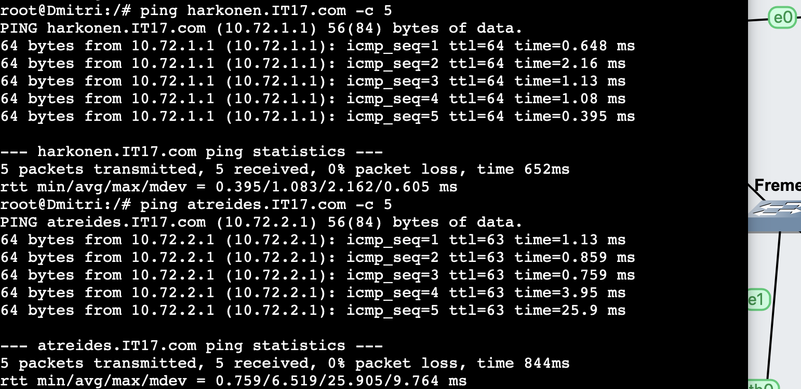
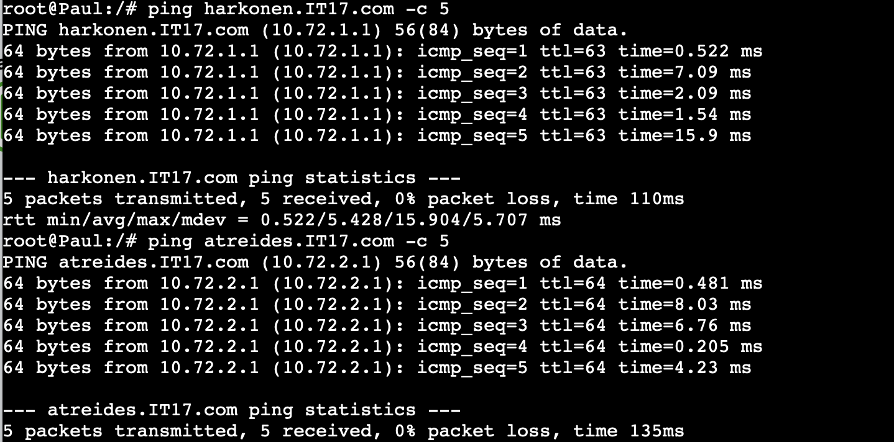

### Soal 1

Lakukan konfigurasi sesuai dengan peta yang sudah diberikan. 

#### Output
Sesuai konfigurasi diatas

### Soal 2

Client yang melalui House Harkonen mendapatkan range IP dari [prefix IP].1.14 - [prefix IP].1.28 dan [prefix IP].1.49 - [prefix IP].1.70

Melakukan setup DHCP Relay terlebih dahulu pada Arakis.

` /etc/default/isc-dhcp-relay `
```
iptables -t nat -A POSTROUTING -o eth0 -j MASQUERADE -s 10.72.0.0/16
apt-get update
apt install isc-dhcp-relay -y

service isc-dhcp-relay start 

echo '# Defaults for isc-dhcp-relay initscript

# sourced by /etc/init.d/isc-dhcp-relay 
# installed at /etc/default/isc-dhcp-relay by the maintainer scripts

#
# This is a POSIX shell fragment
#

# What servers should the DHCP relay forward requests to?
SERVERS="10.72.3.2"

# On what interfaces should the DHCP relay (dhrelay) serve DHCP requests?
INTERFACES="eth1 eth2 eth3 eth4"

# Additional options that are passed to the DHCP relay daemon?
OPTIONS=""' > /etc/default/isc-dhcp-relay


echo net.ipv4.ip_forward=1 > /etc/sysctl.conf

service isc-dhcp-relay restart 
```
Konfigurasi DHCP Server pada Mohiam

```
echo 'nameserver 10.72.3.1' >> /etc/resolv.conf   # Pastikan DNS Server sudah berjalan 
apt-get update
apt-get install isc-dhcp-server -y

interfaces="INTERFACESv4=\"eth0\"
INTERFACESv6=\"\"
"
echo "$interfaces" > /etc/default/isc-dhcp-server

subnet="option domain-name \"example.org\";
option domain-name-servers ns1.example.org, ns2.example.org;

subnet 10.72.1.0 netmask 255.255.255.0 {
    range 10.72.1.14 10.72.1.28;
    range 10.72.1.49 10.72.1.70;
    option routers 10.72.1.0;
}

subnet 10.72.2.0 netmask 255.255.255.0 {
}

subnet 10.72.3.0 netmask 255.255.255.0 {
}

subnet 10.72.4.0 netmask 255.255.255.0 {
}
"
echo "$subnet" > /etc/dhcp/dhcpd.conf

service isc-dhcp-server restart
```
#### Output
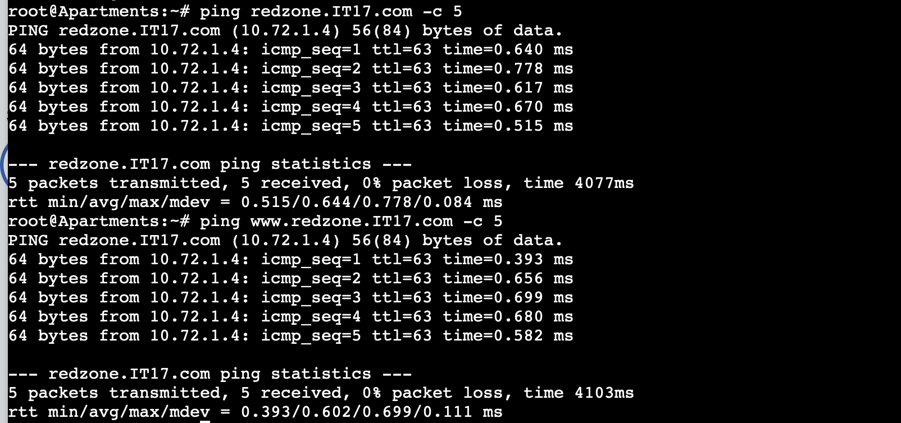
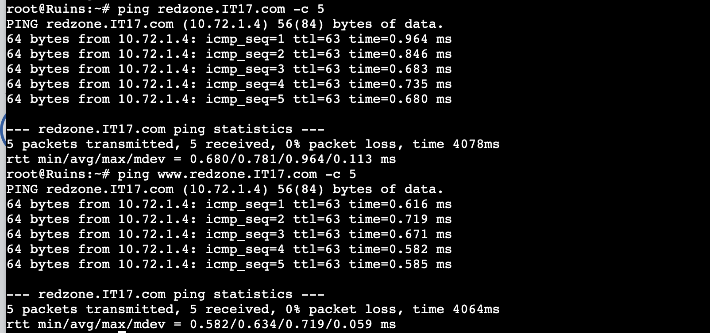

### Soal 3

Client yang melalui House Atreides mendapatkan range IP dari [prefix IP].2.15 - [prefix IP].2.25 dan [prefix IP].2 .200 - [prefix IP].2.210

Konfigurasi DHCP Server pada Mohiam

```
echo 'nameserver 10.72.3.1' >> /etc/resolv.conf   # Pastikan DNS Server sudah berjalan 
apt-get update
apt-get install isc-dhcp-server -y

interfaces="INTERFACESv4=\"eth0\"
INTERFACESv6=\"\"
"
echo "$interfaces" > /etc/default/isc-dhcp-server

subnet="option domain-name \"example.org\";
option domain-name-servers ns1.example.org, ns2.example.org;

subnet 10.72.1.0 netmask 255.255.255.0 {
    range 10.72.1.14 10.72.1.28;
    range 10.72.1.49 10.72.1.70;
    option routers 10.72.1.0;
}

subnet 10.72.2.0 netmask 255.255.255.0 {
    range 10.72.2.15 10.72.2.25;
    range 10.72.2.200 10.72.2.210;
    option routers 10.72.2.0;
}

subnet 10.72.3.0 netmask 255.255.255.0 {
}

subnet 10.72.4.0 netmask 255.255.255.0 {
}
"
echo "$subnet" > /etc/dhcp/dhcpd.conf

service isc-dhcp-server restart
```
#### Output
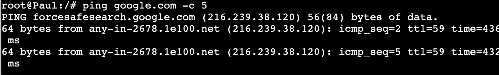
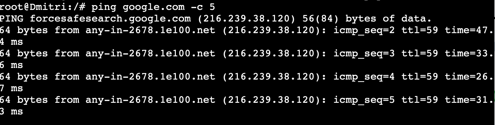

### Soal 5

Markas pusat meminta dibuatnya domain khusus untuk menaruh informasi persenjataan dan suplai yang tersebar. Informasi persenjataan dan suplai tersebut mengarah ke Mylta dan domain yang ingin digunakan adalah loot.xxxx.com dengan alias www.loot.xxxx.com 

#### Script

Dapat dilihat pada nomor 2, 3, dan 4

#### Output

Dapat dilihat pada nomor 2, 3, dan 4


### Soal 7

Akhir-akhir ini seringkali terjadi serangan siber ke DNS Server Utama, sebagai tindakan antisipasi kamu diperintahkan untuk membuat DNS Slave di Georgopol untuk semua domain yang sudah dibuat sebelumnya


#### Script

##### Pochinki
```
echo 'zone "airdrop.IT17.com" {
        type master;
        file "/etc/bind/jarkom/airdrop.IT17.com";
        allow-transfer { 10.72.2.3; };
        also-notify { 10.72.2.3; };
};' > /etc/bind/named.conf.local


echo 'zone "redzone.IT17.com" {
        type master;
        file "/etc/bind/jarkom/redzone.IT17.com";
        also-notify { 10.72.2.3; };
        allow-transfer { 10.72.2.3; };

};' >> /etc/bind/named.conf.local

echo 'zone "loot.IT17.com" {
        type master;
        file "/etc/bind/jarkom/loot.IT17.com";
        also-notify { 10.72.2.3; };
        allow-transfer { 10.72.2.3; }; 
   
};' >>/etc/bind/named.conf.local
```
##### Georgopol
```
echo 'zone "airdrop.IT17.com" {
    type slave;
    masters { 10.72.3.2; }; // Masukan IP EniesLobby tanpa tanda petik
    file "/var/lib/bind/airdrop.IT17.com";
};

zone "redzone.IT17.com" {
    type slave;
    masters { 10.72.3.2; }; // Masukan IP EniesLobby tanpa tanda petik
    file "/var/lib/bind/redzone.IT17.com";
};

zone "loot.IT17.com" {
    type slave;
    masters { 10.72.3.2; }; // Masukan IP EniesLobby tanpa tanda petik
    file "/var/lib/bind/loot.IT17.com";
};'  > /etc/bind/named.conf.local

```
#### Output
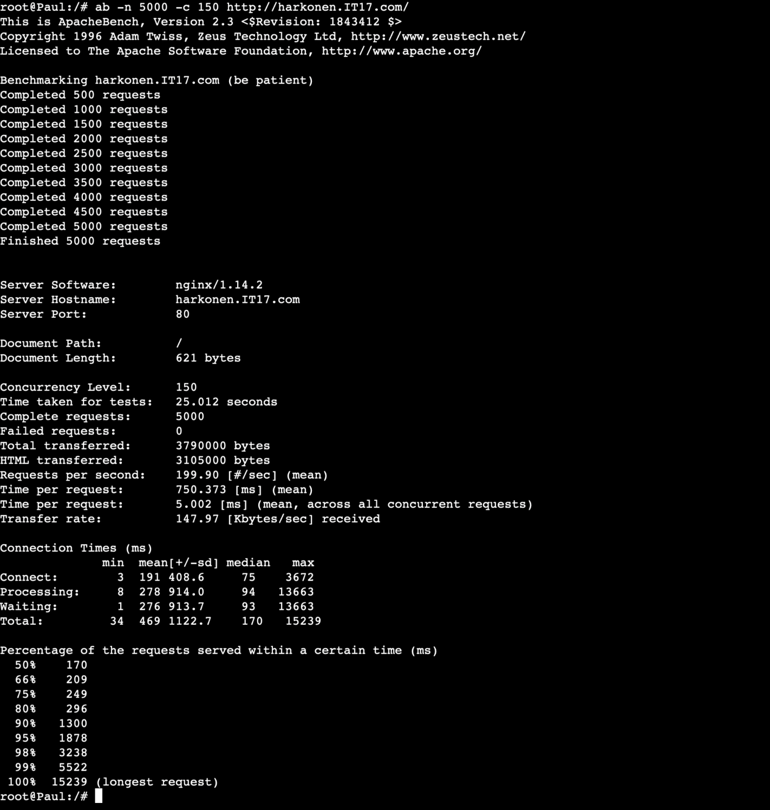
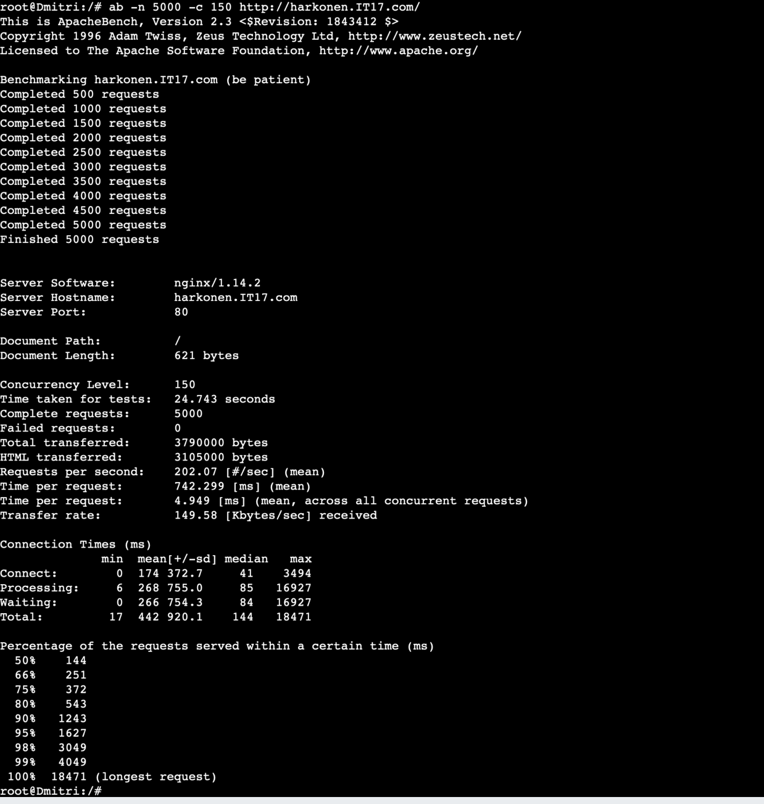
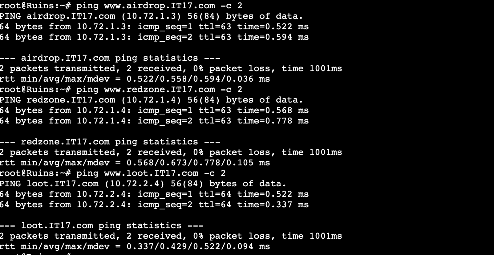

### Soal 8

Kamu juga diperintahkan untuk membuat subdomain khusus melacak airdrop berisi peralatan medis dengan subdomain medkit.airdrop.xxxx.com yang mengarah ke Lipovka


#### Script

```
echo '
;
; BIND data file for local loopback interface
;
$TTL    604800
@       IN      SOA     airdrop.IT17.com. root.airdrop.IT17.com. (
                        2023101001      ; Serial
                         604800         ; Refresh
                          86400         ; Retry
                        2419200         ; Expire
                         604800 )       ; Negative Cache TTL
;
@       IN      NS      airdrop.IT17.com.
@       IN      A       10.72.1.3   ; 
www     IN      CNAME   airdrop.IT17.com.
medkit  IN      A       10.72.1.2     ;' > /etc/bind/jarkom/airdrop.IT17.com

service bind9 restart
```
#### Output
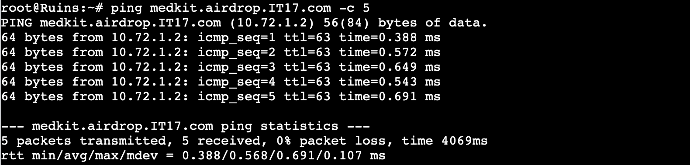
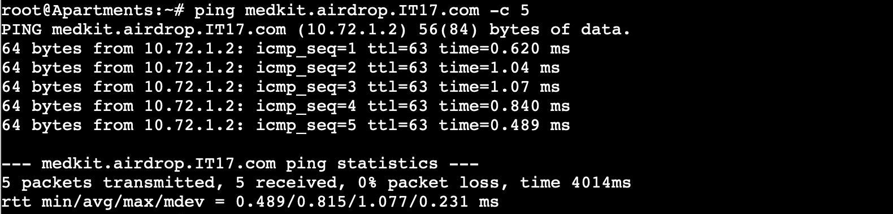

### Soal 9

Terkadang red zone yang pada umumnya di bombardir artileri akan dijatuhi bom oleh pesawat tempur. Untuk melindungi warga, kita diperlukan untuk membuat sistem peringatan air raid dan memasukkannya ke subdomain siren.redzone.xxxx.com dalam folder siren dan pastikan dapat diakses secara mudah dengan menambahkan alias www.siren.redzone.xxxx.com dan mendelegasikan subdomain tersebut ke Georgopol dengan alamat IP menuju radar di Severny


#### Script
##### Pochinki

```
echo ';
; BIND data file for local loopback interface
;
$TTL    604800
@       IN      SOA     redzone.IT17.com. root.redzone.IT17.com. (
                        2023101001      ; Serial
                         604800         ; Refresh
                          86400         ; Retry
                        2419200         ; Expire
                         604800 )       ; Negative Cache TTL
;
@       IN      NS      redzone.IT17.com.
@       IN      A       10.72.1.4
www     IN      CNAME   redzone.IT17.com.
ns1     IN      A       10.72.2.3     ; IP georgopol
siren   IN      NS      ns1' > /etc/bind/jarkom/redzone.IT17.com


echo "options {
    directory \"/var/cache/bind\";

    // If there is a firewall between you and nameservers you want
    // to talk to, you may need to fix the firewall to allow multiple
    // ports to talk.  See http://www.kb.cert.org/vuls/id/800113

    // If your ISP provided one or more IP addresses for stable
    // nameservers, you probably want to use them as forwarders.
    // Uncomment the following block, and insert the addresses replacing
    // the all-0's placeholder.  
    // };

    //========================================================================
    // If BIND logs error messages about the root key being expired,
    // you will need to update your keys.  See https://www.isc.org/bind-keys
    //========================================================================
    //dnssec-validation auto;

    allow-query { any; };
    auth-nxdomain no;
    listen-on-v6 { any; };
};" > /etc/bind/named.conf.options

service bind9 restart
```
##### Georgopol
```
echo "
options {
        directory \"/var/cache/bind\";
        allow-query{any;};
        auth-nxdomain no;    # conform to RFC1035
        listen-on-v6 { any; };
};
" > /etc/bind/named.conf.options

echo '

zone "siren.redzone.IT17.com"{
        type master;
        file "/etc/bind/siren/siren.redzone.IT17.com";
};
'>> /etc/bind/named.conf.local

mkdir /etc/bind/siren

echo "
\$TTL    604800
@       IN      SOA     siren.redzone.IT17.com. root.siren.redzone.IT17.com. (
                        2021100401      ; Serial
                        604800         ; Refresh
                        86400         ; Retry
                        2419200         ; Expire
                        604800 )       ; Negative Cache TTL
;
@               IN      NS      siren.redzone.IT17.com.
@               IN      A       10.72.1.4       ;ip skypie
www             IN      CNAME   siren.redzone.IT17.com.
" > /etc/bind/siren/siren.redzone.IT17.com
service bind9 restart
```

#### Output
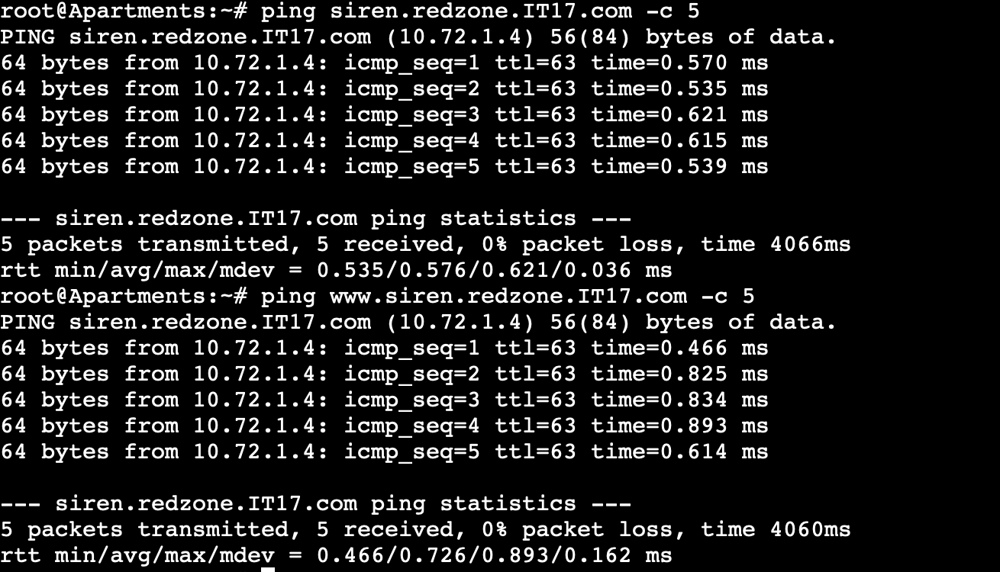
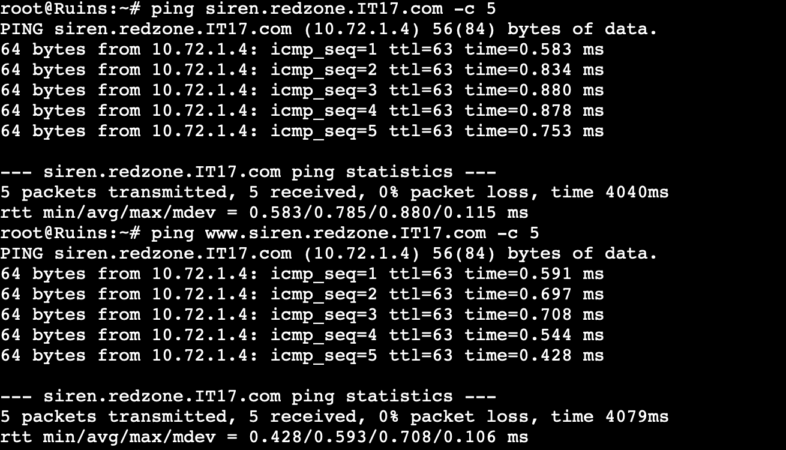

### Soal 10

Markas juga meminta catatan kapan saja pesawat tempur tersebut menjatuhkan bom, maka buatlah subdomain baru di subdomain siren yaitu log.siren.redzone.xxxx.com serta aliasnya www.log.siren.redzone.xxxx.com yang juga mengarah ke Severny


#### Script
##### Georgopol

```
echo "
\$TTL    604800
@       IN      SOA     siren.redzone.IT17.com. root.siren.redzone.IT17.com. (
                        2021100401      ; Serial
                        604800         ; Refresh
                        86400         ; Retry
                        2419200         ; Expire
                        604800 )       ; Negative Cache TTL
;
@               IN      NS      siren.redzone.IT17.com.
@               IN      A       10.72.1.4       ;
www             IN      CNAME   siren.redzone.IT17.com.
log             IN      A       10.72.1.4      ; 
www.log         IN      CNAME   log.siren.redzone.IT17.com." > /etc/bind/siren/siren.redzone.IT17.com
service bind9 restart
```

#### Output
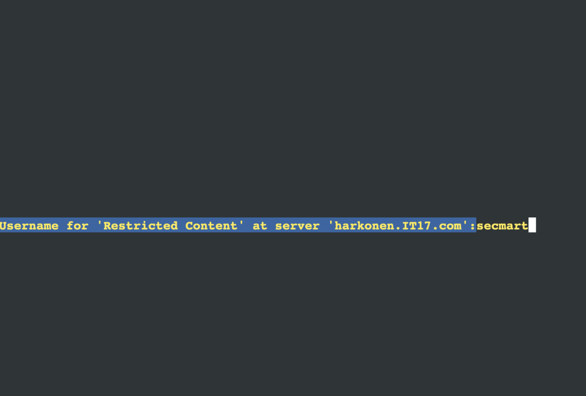


### Soal 12

Karena pusat ingin sebuah website yang ingin digunakan untuk memantau kondisi markas lainnya maka deploy lah webiste ini (cek resource yg lb) pada severny menggunakan apache


#### Script
##### Serverny

```
service apache2 restart
service apache2 status

echo '
<VirtualHost *:80>
    ServerAdmin webmaster@localhost
    DocumentRoot /var/www/html/severny
    ErrorLog ${APACHE_LOG_DIR}/error.log
    CustomLog ${APACHE_LOG_DIR}/access.log combined
</VirtualHost>
' > /etc/apache2/sites-available/000-default.conf

mkdir -p /var/www/html/severny

echo '
<?php
$hostname = gethostname();
$date = date('Y-m-d H:i:s');
$php_version = phpversion();
$username = get_current_user();


echo "Hello World!<br>";
echo "Saya adalah: $username<br>";
echo "Saat ini berada di: $hostname<br>";
echo "Versi PHP yang saya gunakan: $php_version<br>";
echo "Tanggal saat ini: $date<br>";
?>
' > /var/www/html/severny/index.php
```

#### Output
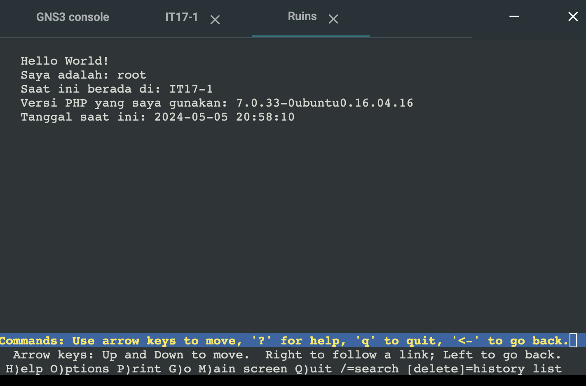

### Soal 13

Tapi pusat merasa tidak puas dengan performanya karena traffic yag tinggi maka pusat meminta kita memasang load balancer pada web nya, dengan Severny, Stalber, Lipovka sebagai worker dan Mylta sebagai Load Balancer menggunakan apache sebagai web server nya dan load balancernya


#### Script
##### Mylta

```
service apache2 start
a2enmod proxy
a2enmod proxy_http
a2enmod proxy_balancer
a2enmod lbmethod_byrequests

service apache2 restart
service apache2 status

echo '<VirtualHost *:80>
   <Proxy balancer://mycluster>
BalancerMember http://10.72.1.4:80
BalancerMember http://10.72.1.2:80
      BalancerMember http://10.72.1.3:80
    </Proxy>
    ProxyPreserveHost On
    ProxyPass / balancer://mycluster/
    ProxyPassReverse / balancer://mycluster/
</VirtualHost>' >/etc/apache2/sites-available/000-default.conf

service apache2 restart
service apache2 status
service apache2 start

```

##### Stalber

```
service apache2 restart
service apache2 status

echo '
<VirtualHost *:80>
    ServerAdmin webmaster@localhost
    DocumentRoot /var/www/html/stalber
    ErrorLog ${APACHE_LOG_DIR}/error.log
    CustomLog ${APACHE_LOG_DIR}/access.log combined
</VirtualHost>
' > /etc/apache2/sites-available/000-default.conf

mkdir -p /var/www/html/stalber

echo '
<?php
$hostname = gethostname();
$date = date('Y-m-d H:i:s');
$php_version = phpversion();
$username = get_current_user();


echo "Hello World!<br>";
echo "Saya adalah: $username<br>";
echo "Saat ini berada di: $hostname<br>";
echo "Versi PHP yang saya gunakan: $php_version<br>";
echo "Tanggal saat ini: $date<br>";
?>
' > /var/www/html/stalber/index.php
```

##### Serverny

```
service apache2 restart
service apache2 status

echo '
<VirtualHost *:80>
    ServerAdmin webmaster@localhost
    DocumentRoot /var/www/html/serverny
    ErrorLog ${APACHE_LOG_DIR}/error.log
    CustomLog ${APACHE_LOG_DIR}/access.log combined
</VirtualHost>
' > /etc/apache2/sites-available/000-default.conf

mkdir -p /var/www/html/serverny

echo '
<?php
$hostname = gethostname();
$date = date('Y-m-d H:i:s');
$php_version = phpversion();
$username = get_current_user();


echo "Hello World!<br>";
echo "Saya adalah: $username<br>";
echo "Saat ini berada di: $hostname<br>";
echo "Versi PHP yang saya gunakan: $php_version<br>";
echo "Tanggal saat ini: $date<br>";
?>
' > /var/www/html/serverny/index.php
```
##### Lipovka

```
service apache2 restart
service apache2 status

echo '
<VirtualHost *:80>
    ServerAdmin webmaster@localhost
    DocumentRoot /var/www/html/lipovka
    ErrorLog ${APACHE_LOG_DIR}/error.log
    CustomLog ${APACHE_LOG_DIR}/access.log combined
</VirtualHost>
' > /etc/apache2/sites-available/000-default.conf

mkdir -p /var/www/html/lipovka

echo '
<?php
$hostname = gethostname();
$date = date('Y-m-d H:i:s');
$php_version = phpversion();
$username = get_current_user();


echo "Hello World!<br>";
echo "Saya adalah: $username<br>";
echo "Saat ini berada di: $hostname<br>";
echo "Versi PHP yang saya gunakan: $php_version<br>";
echo "Tanggal saat ini: $date<br>";
?>
' > /var/www/html/lipovka/index.php
```
#### Output
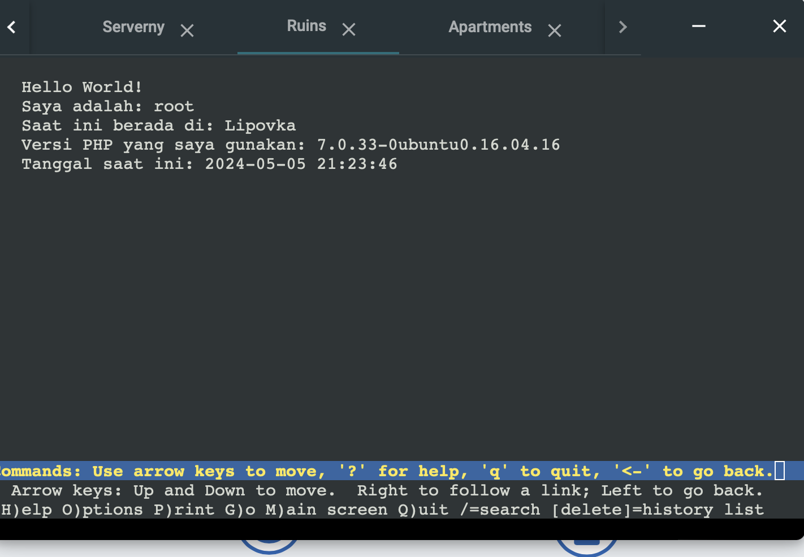
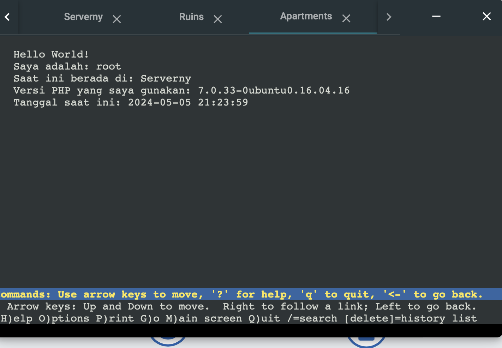
