# Jarkom-Modul-3-IT17-2024

##### Praktikum Jaringan Komputer Modul 3 Tahun 2024

### Author
| Nama | NRP |
|---------|---------|
| Mutiara Nurhaliza | 5027221010   |
| Aqila Aqsa | 5027211032   |

# Laporan Resmi
Menggunakan perhitungan ``CIDR`` dengan menggunakan ``GNS3`` dan ``VLSM`` dengan menggunakan ``Cisco``

## CIDR 
### Topologi
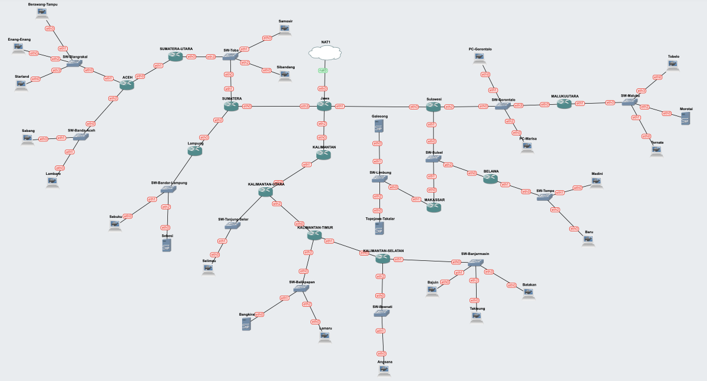

### Penggabungan
#### Penggabungan A
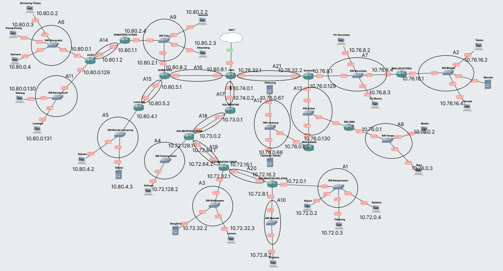

#### Penggabungan B
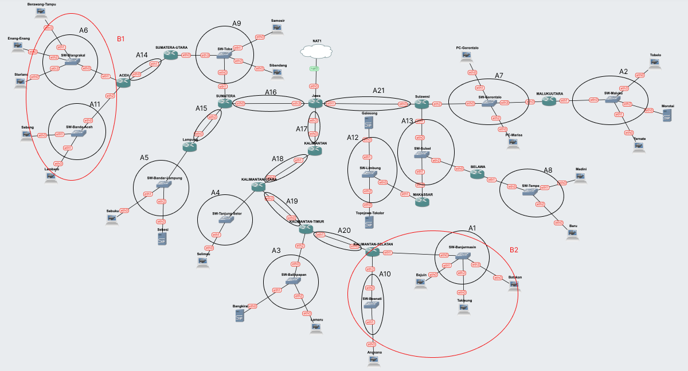


#### Penggabungan C
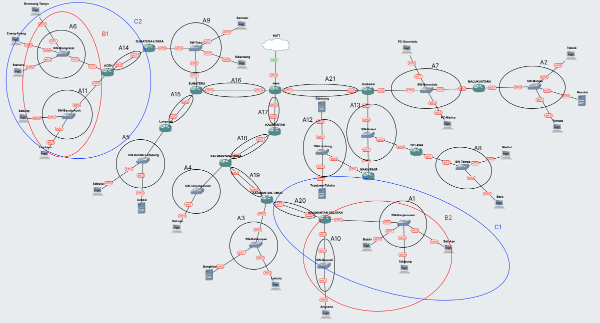


#### Penggabungan D
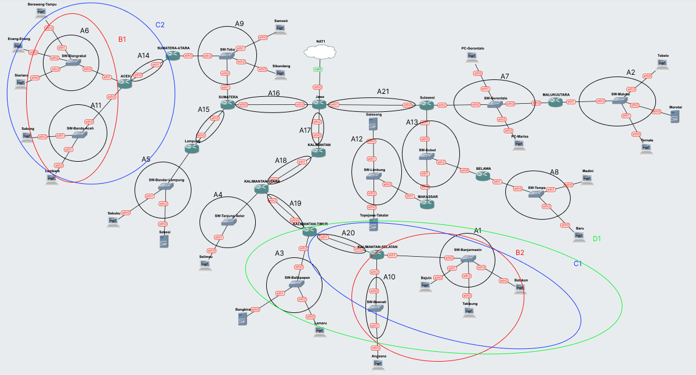


#### Penggabungan E
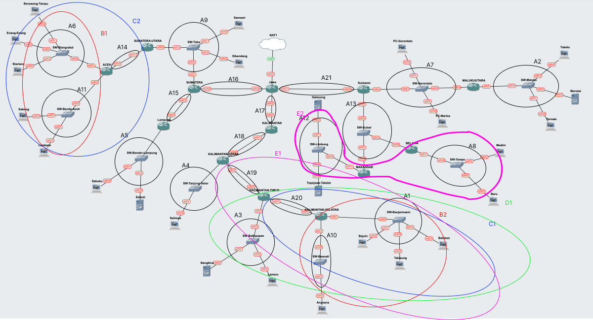


#### Penggabungan F
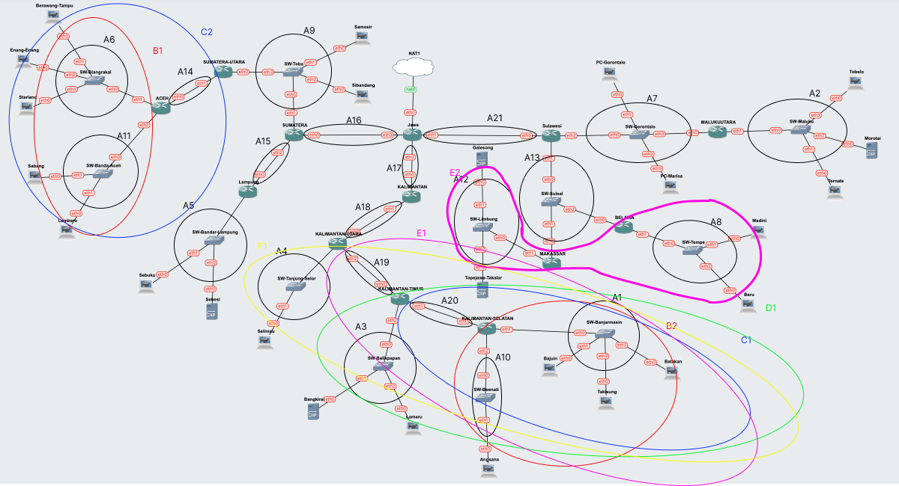


#### Penggabungan G
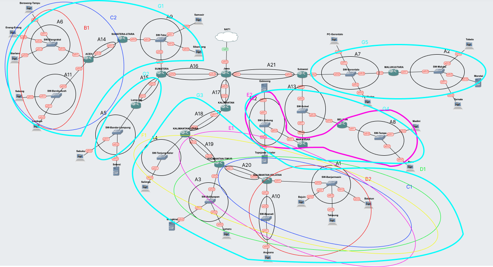


#### Penggabungan H
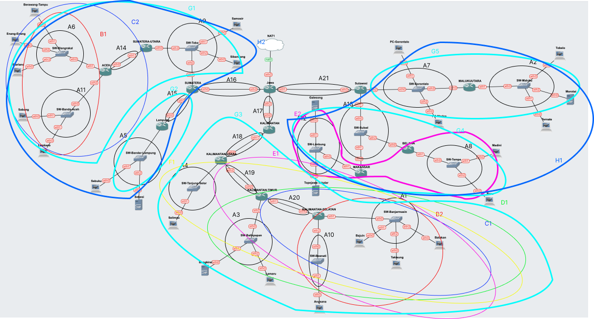


#### Penggabungan I
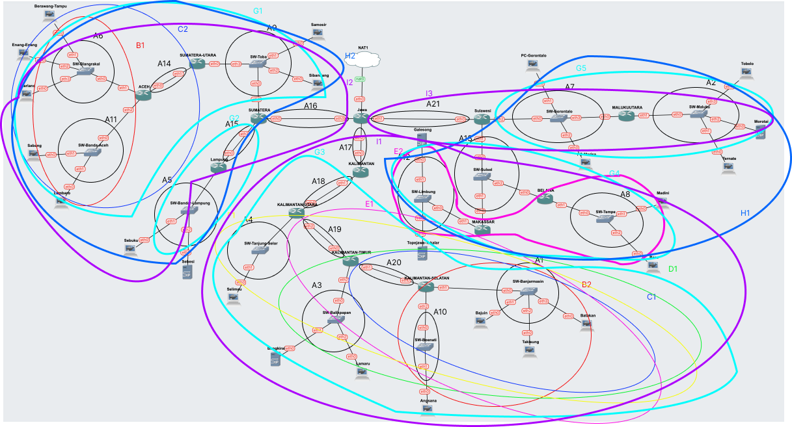


#### Penggabungan J
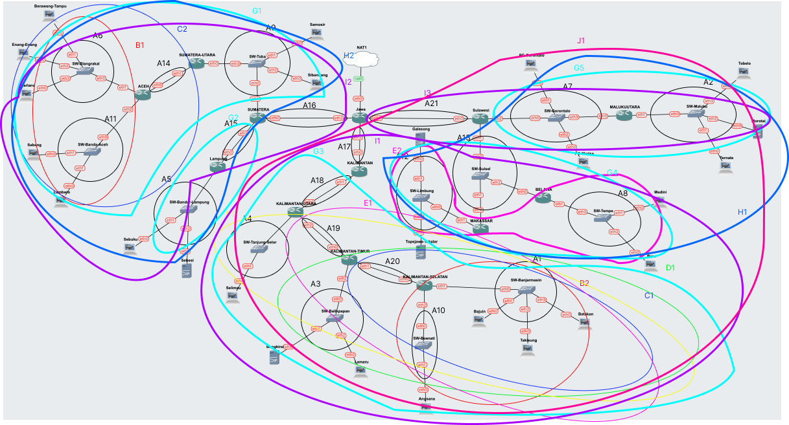


#### Penggabungan K
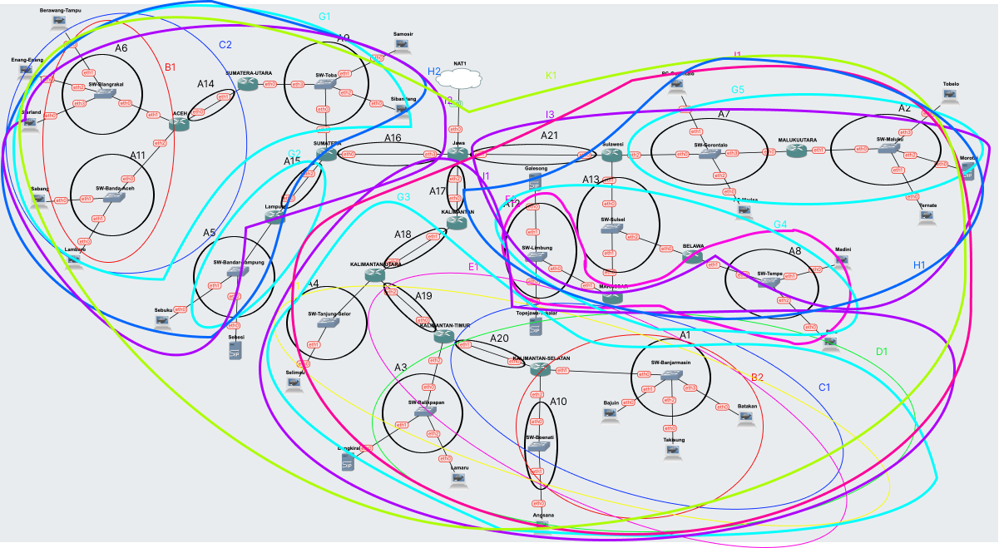


### Tree
Setelah dilakukannya ``penggabungan IP``, sekarang kita melakukan pembagian IP dengan menggunakan ``tree`` pada masing-masing kelompok yang telah dibuat sebelumnya sebagai berikut
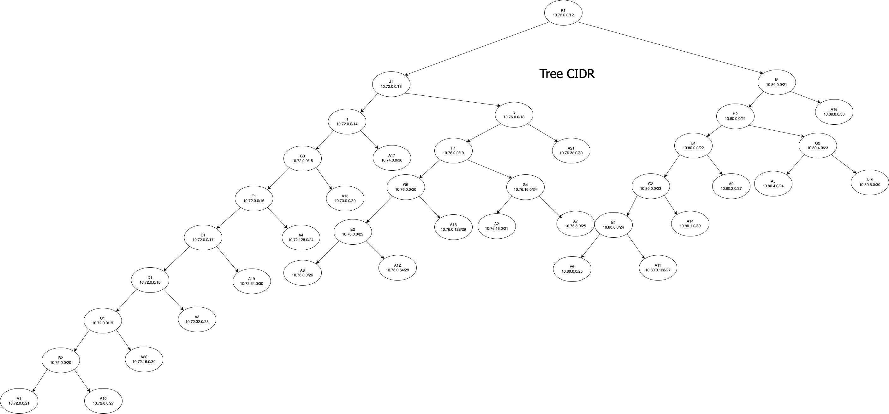

### Pembagian IP
Berikut merupakan hasil dari pembagian IP berdasarkan Tree yang telah dibuat sebelumnya 


### Konfigurasi network 
#### Jawa
```
auto lo
iface lo inet loopback

auto eth0
iface eth0 inet dhcp

#A16 Jawa-Sumatera
auto eth2
iface eth2 inet static
address 10.80.8.1
netmask 255.255.255.252

#A17 Jawa-Kalimantan
auto eth1
iface eth1 inet static
address 10.74.0.1
netmask 255.255.255.252

#A21 Jawa-Sulawesi
auto eth3
iface eth3 inet static
address 10.76.32.1
netmask 255.255.255.252
```

#### Kalimantan

```
    auto lo
    iface lo inet loopback

    #A17 Kalimantan-Jawa
    auto eth0
    iface eth0 inet static
	address 10.74.0.2
	netmask 255.255.255.252
    gateway 10.74.0.1

    #A18 Kalimantan-KalUtara
    auto eth1
    iface eth1 inet static
	address 10.73.0.1
	netmask 255.255.255.252
```
#### Kalimantan Utara 
```
        auto lo
        iface lo inet loopback

        #A18 KalUtara-Kalimantan
        auto eth0
        iface eth0 inet static
	    address 10.73.0.2
	    netmask 255.255.255.252
        gateway 10.73.0.1

        #A4 KalUtara-SwTanjungSelor
        auto eth1
        iface eth1 inet static
	    address 10.72.128.1
	    netmask 255.255.255.0

        #A19 KalUtara-KalTim
        auto eth2
        iface eth2 inet static
	    address 10.72.64.1
	    netmask 255.255.255.252
```

#### Selimau 
```
#Selimau#
#A4 Selimau-SwTanjungSelor
auto eth0
iface eth0 inet static
address 10.72.128.2
netmask 255.255.255.0
gateway 10.72.128.1  
```
#### Kalimantan Timur
```
                auto lo
                iface lo inet loopback

                #A19 KalTim-KalUtara
                auto eth0
                iface eth0 inet static
                address 10.72.64.2
                netmask 255.255.255.252
                gateway 10.72.64.1

                #A3 KalTimur-SwBalikPapan
                auto eth1
                iface eth1 inet static
                address 10.72.32.1
                netmask 255.255.254.0

                #A20 KalTimur-KalSel
                auto eth2
                iface eth2 inet static
                address 10.72.16.1
                netmask 255.255.255.252
```

#### Sulawesi

```
auto lo
iface lo inet loopback

#A21 Sulawesi-Jawa
auto eth0
iface eth0 inet static
address 10.76.32.2
netmask 255.255.255.252
gateway 10.76.32.1

#A13 Sulawesi-Swsulsel
auto eth2
iface eth2 inet static
address 10.76.0.129
netmask 255.255.255.248

#A7 Sulawesi-Swgorontalo
auto eth1
iface eth1 inet static
address 10.76.8.1
netmask 255.255.255.128
```

#### Sumatera
```
 auto lo
    iface lo inet loopback

    #A16 Sumatera-Jawa
    auto eth0
    iface eth0 inet static
    address 10.80.8.2
    netmask 255.255.255.252
    gateway 10.80.8.1

    #A9 Sumatera-SWToba
    auto eth1
    iface eth1 inet static
    address 10.80.2.1
    netmask 255.255.255.224

    #A15 Sumatera-Lampung
    auto eth2
    iface eth2 inet static
    address 10.80.5.1
    netmask 255.255.255.252
```

